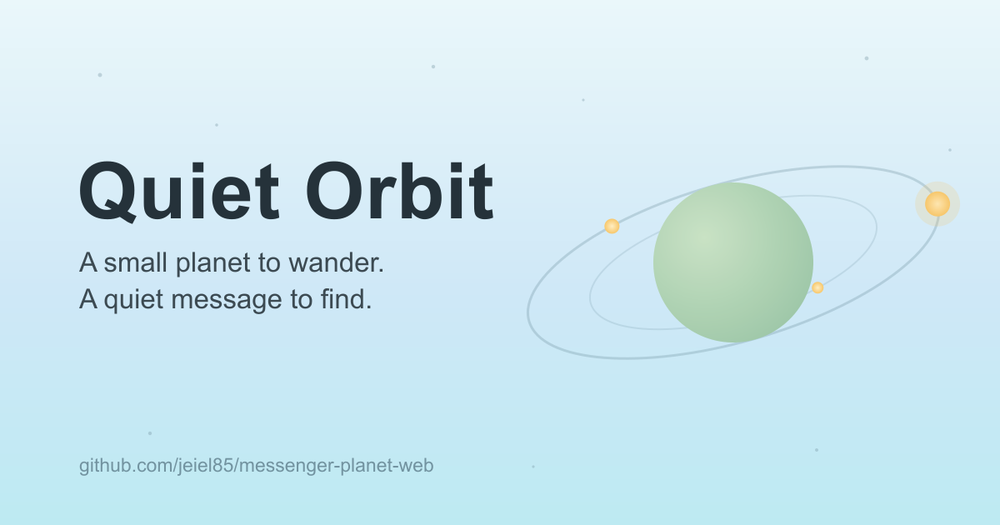

# Quiet Orbit



작은 행성 위를 천천히 산책하며, 빛나는 메시지 조각(Orb)을 발견하는 **조용한 3D 웹 경험**입니다.
경쟁도 점수도 없이, 1분 남짓 머물며 따뜻한 흔적을 읽고 가는 스탠드얼론 인터랙티브 사이트입니다.

> 고품질 브라우저 3D 경험에서 *감성적 구조*만 벤치마킹한 **독립 프로젝트**입니다.
> 특정 사이트의 브랜드·캐릭터·에셋·맵·텍스트를 복제하지 않습니다.

▶️ **라이브 데모** · https://quiet-orbit.vercel.app
🪐 **소개 페이지** · https://jeiel85.github.io/quiet-orbit/
📐 **설계 문서** · [`docs/design/`](docs/design/)

## 기술 스택

- **Next.js (App Router) + TypeScript**
- **Three.js + @react-three/fiber + @react-three/drei**
- **zustand** (전역 상태)
- **Tailwind CSS v4**
- **localStorage** (MVP 진행도 저장)
- **Vercel** 배포 — 라이브: https://quiet-orbit.vercel.app

## 주요 기능

- 작은 행성 표면을 따라 걷는 **구면 이동** + 부드러운 3인칭 추적 카메라
- 표면에 흩어진 **메시지 Orb** — 가까이 가면 안내가 뜨고, 열어서 읽을 수 있음
- 읽은 메시지는 흐릿해지고, **새로고침 후에도 읽음 상태 유지**(localStorage)
- 시작 안내 **인트로 오버레이**
- **모바일 가상 조이스틱** + 데스크톱 키보드 조작
- 나무·돌·집 등 **primitive 장식 오브젝트**
- **동작 줄이기(reduce motion)** 설정 존중, 모바일 성능 옵션(dpr/antialias 하향)

## 조작법

| | 데스크톱 | 모바일 |
|---|---|---|
| 이동 | `W`/`A`/`S`/`D` 또는 방향키 | 좌하단 가상 조이스틱 |
| 메시지 열기 | `Space` / `Enter`, 또는 Orb 클릭 | 가까운 Orb 탭 |
| 메시지 닫기 | `Esc` 또는 닫기 버튼 | 닫기 버튼 / 배경 탭 |

메시지 패널이 열려 있는 동안에는 이동이 잠깁니다.

## 로컬 실행

```bash
npm install
npm run dev      # http://localhost:3000
npm run build    # 프로덕션 빌드 검증
npm run lint
```

## 개발 진행 상태

[`docs/design/11_development_goals.md`](docs/design/11_development_goals.md) 의 Goal 1~5 순서로 진행했습니다.

- [x] **Goal 1** — 프로젝트 스캐폴딩 + 전체 화면 3D Canvas
- [x] **Goal 2** — 행성 + 플레이어 + 3인칭 카메라
- [x] **Goal 3** — 메시지 Orb + 상호작용 UI + localStorage
- [x] **Goal 4** — 모바일 조작 + 비주얼 폴리싱 + 성능
- [x] **Goal 5** — Vercel 배포 정리 + 온라인 확장 준비

## 폴더 구조 (요약)

```txt
app/                      Next.js 엔트리 (layout/page/globals.css/아이콘·OG 메타)
components/experience/    Canvas · Scene 구성
components/world/         Planet · MessageOrb(Group) · Decorations
components/player/        Player(구면 이동) · CameraRig
components/controls/      키보드 입력 · 메시지 키 · 모바일 조이스틱
components/ui/            인트로 · 상호작용 힌트 · 메시지 패널 · 로딩
config/                   theme · worldConfig · messages · decorations
lib/math/                 sphericalMovement · sphericalCoords
lib/input/                키보드+조이스틱 합산 싱글톤(movementInput)
lib/storage/              localProgress (localStorage 접근 일원화)
lib/audio/                soundManager (구조 스텁)
store/                    useGameStore · useMessageStore · useSettingsStore
types/                    world · message · online(확장용 타입)
public/                   models / textures / audio (각 README 참고)
docs/                     GitHub Pages 소개 페이지 + 설계 묶음(docs/design/)
```

## 데이터 · 상태

- 메시지는 정적 데이터([`config/messages.ts`](config/messages.ts)). 위치는 구면 좌표(theta/phi).
- 읽음 상태는 localStorage([`lib/storage/localProgress.ts`](lib/storage/localProgress.ts))에만 저장 — 서버·로그인 없음.
- 상태는 zustand 3분할: 게임(active/opened/started) · 메시지(read) · 설정(reduce motion/touch/sound).
- **온라인 확장 준비**: 실제 서버 연동은 하지 않되, 후속(방명록/흔적/presence)용 타입을
  [`types/online.ts`](types/online.ts) 에 정의해 두었습니다. 자세한 계획은
  [`docs/design/10_multiplayer_future.md`](docs/design/10_multiplayer_future.md).

## 배포 (Vercel)

이 저장소에는 두 가지 다른 배포가 있습니다.

- **소개 페이지**(`docs/index.html`)는 **GitHub Pages** 로 자동 배포됩니다 — 위 🪐 링크.
- **실제 3D 앱**(Next.js)은 **Vercel** 에 배포됩니다 — 라이브: https://quiet-orbit.vercel.app
  GitHub 저장소가 연결돼 있어 `main` 에 push 하면 자동으로 프로덕션 배포됩니다.

### GitHub 연결 배포

1. [vercel.com](https://vercel.com) → **New Project**
2. 이 GitHub 저장소 import
3. Framework Preset: **Next.js** (자동 감지)
4. Build Command `next build` · Output 기본값
5. 환경변수 없음(MVP) → **Deploy**

### Vercel CLI 배포

```bash
npm i -g vercel
vercel          # preview 배포
vercel --prod   # production 배포
```

### 주의사항

- **클라이언트 전용 3D**: 3D Experience 는 `dynamic(..., { ssr: false })` 로 로드합니다. WebGL/`window` 의존 코드를 서버에서 실행하지 않습니다.
- **정적 에셋**: GLB/텍스처/오디오는 `public/` 아래에 두면 그대로 제공됩니다. 캐시를 위해 파일명에 버전을 포함하세요(`planet-v001.glb`).
- **WebSocket**: 후속에 실시간 멀티플레이가 필요하면 Vercel 은 프론트 배포로 두고, WebSocket 계층은 PartyKit/Supabase Realtime 등 별도 서비스로 분리합니다.
- **배포 전 체크**: `npm run build` / `npm run lint` 통과, 모바일 viewport, localStorage 오류 처리, WebGL 정상 실행.

## 라이선스 · 출처

이 저장소의 코드와 비주얼 자산은 직접 제작한 것이며, 벤치마킹 대상 사이트의 어떤 저작물도
포함하지 않습니다. 자세한 작업 규칙은 [`AGENTS.md`](AGENTS.md) 를 참고하세요.
